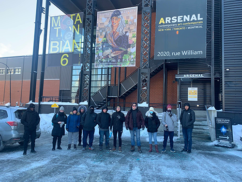
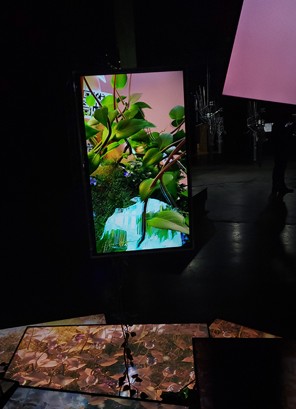
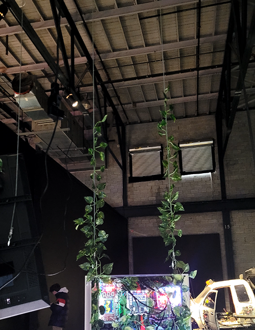
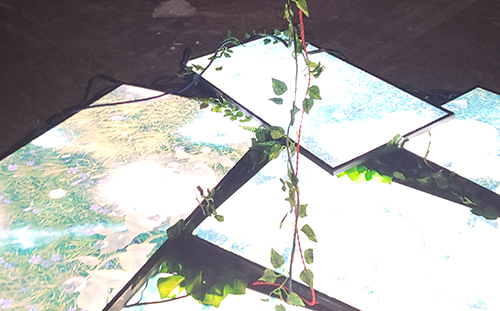
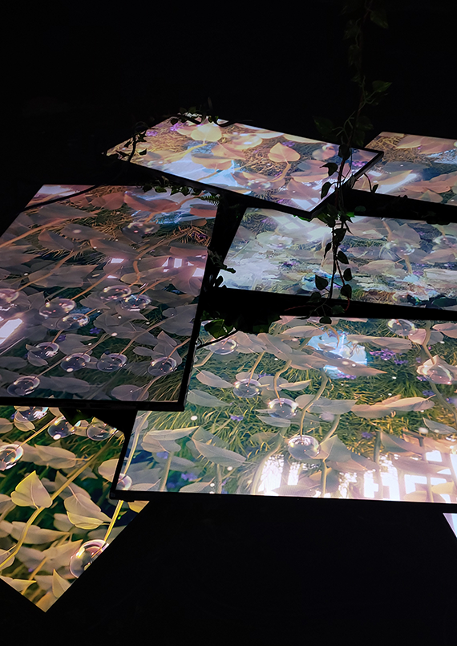

#  Exposition Bian 
Lieu d'exposition: Arsenal art contemporain

2ème personne à partir de la gauche

photo par Khaly Tia Sing

Exposition temporaire
Date de visite: 3 février 2023
## Nature Morte 7

# Nom de l'artiste: Baron Lanteigne
## Année de creation: 2022
## Description de l'oeuvre

photo par Kristy Moussally
## type d'instalation : contemplative
## Mise en espace
photo croquit et texte
L'oeuvre est situé par terre proche d'un mur. Elle prend pas beaucoup de place.L'oeuvre est soutenu par des cordes qui la fait suspendre du plafond.

## Composantes et techniques
- sculpture 
- 
- plante
animation des écrans
## Éléments nécessaires à la mise en exposition
- fil et extention

- écran

## Expérience vécue
le visiteur peut facilement faire le tour de l'oeuvre 

