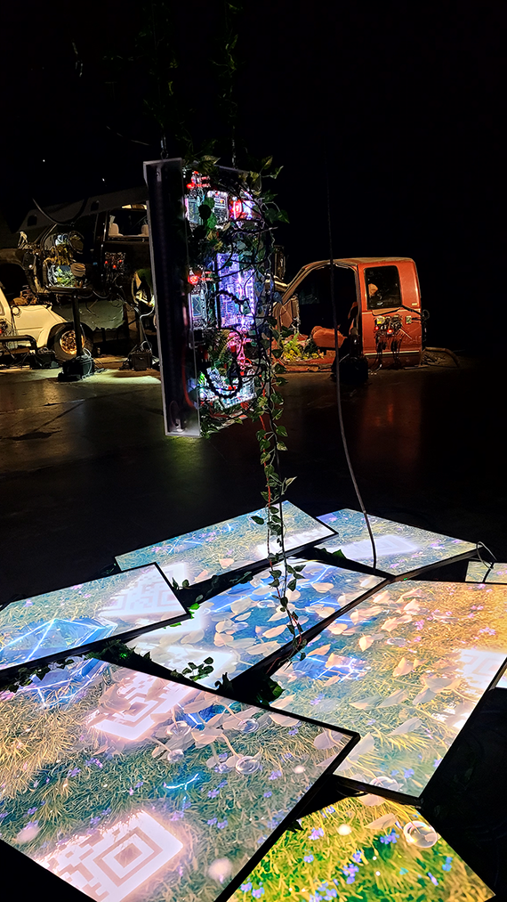

#  Expositio Bian 
Lieu d'exposition: Arsenal art contemporain
Exposition temporaire
Date de visite: 3 février 2023
## Nature Morte 7

# Nom de l'artiste: Baron Lanteigne
## Année de creation: 2022
## Description de l'oeuvre

## type d'instalation : contemplative
## Mise en espace
photo croquit et texte
L'oeuvre est situé par terre proche d'un mur. Elle prend pas beaucoup de place. l'oeuvre est soutenu par des cordes qui la fait suspendre du plafond 
## Composantes et techniques
- sculpture 
- 
- plante
animation des écrans
## Éléments nécessaires à la mise en exposition
- fil et extention

- écran

## Expérience vécue
le visiteur peut facilement faire le tour de l'oeuvre 

