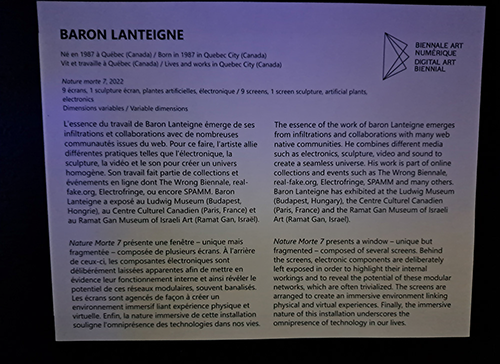

#  Exposition Bian 
Lieu d'exposition: Arsenal art contemporain

2ème personne à partir de la gauche

photo par Khaly Tia Sing

Exposition temporaire
Date de visite: 3 février 2023
## Nature Morte 7

# Nom de l'artiste: Baron Lanteigne
## Année de creation: 2022
## Description de l'oeuvre

photo par Kristy Moussally
## type d'instalation : contemplative
## Mise en espace
photo croquit et texte
L'oeuvre est situé par terre proche d'un mur. Elle prend pas beaucoup de place.L'oeuvre est soutenu par des cordes qui la fait suspendre du plafond.

Malgré le fait qu'il y a une autre oeuvre plus imposante derrière elle, elle n'est pas effacer, on l'a remarque quand même bien, car malgré le fait qu'elles sont proche l'une de l'autre, on va s'intéroger a pourquoi il y a des écran par terre, donc le fait qu'elle soit devant l'oeuvre : Tomorrow's Borrowed-scenery fait en sorte qu'on va s'arreter par elle devant à cause qu'on s'intéroge sur ce qu'elle représente. 

## Composantes et techniques
- sculpture 
- 
- plante
animation des écrans
## Éléments nécessaires à la mise en exposition
- fil et extention

- écran

## Expérience vécue
le visiteur peut facilement faire le tour de l'oeuvre, ce qui est particulièrement intérésant quand l'oeuvre a comme plusieurs aspects à contempler.
## Se que j'ai aimé à propos de l'oeuvre
Un des première chose pour laquelle j'ai aimé l'oeuvre ces un peu le mystère. Quand on est loin de l'oeuvre on se demande c'est quoi qui est accrocher au plafond et qu'est ce qu'il y a par terre. C'est la que sa ma intriguer et que j'ai voulu savoir s'était quoi, et la j'ai vu que sur les télés il y avait une animation de nature, qui pour être honnête était simple mais vraiment belle.

##  Aspect que vous ne souhaiteriez pas retenir pour vos propres créations ou que vous feriez autrement

Un des aspect que j'aurais faite autrement ça serait de mettre un peu d'interactivité par exemple on pourrait cliquer sur un élément sur l'écran et sa change l'animation.Aussi peut être créer un aspect immersif par exemple avoir d'autre projection sur les murs ou même une sorte de musique d'ambiance 

