# Mission Virtuelle : Aux frontières du cosmos

## Lieu de l'exposition
Le Cosmodome à Laval

## Type d'exposition
Les missions virtuels sont des expositions permanantes.

## Date de la visite
1er mars 2023

## Titre de l'oeuvre 

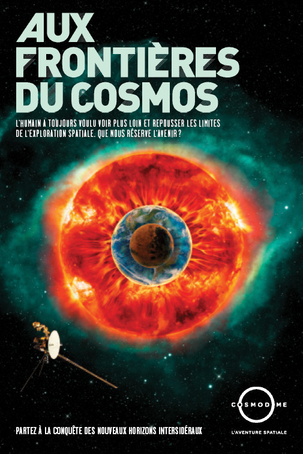</img>
## Nom de l'artiste ou de la firme
L'oeuvre à été créer par le Cosmodome

## Année de création
Les trois missions virtuelles ont été présenter pour la premier fois en 2012 

## Description de l'oeuvre ou du dispositif 
> Les destinations les plus fascinantes sont souvent très éloignées et situées dans un milieu hostile. Pour réussir votre voyage dans le système solaire, vous devrez envoyer en mission, sur la planète de votre choix, votre fidèle éclaireuse : une sonde courageuse, prête à affronter tous les dangers et à percer les mystères de contrées inconnues. Derrière chaque sonde se cache un humain; derrière chaque humain se cache une mission. À vous de trouver la vôtre… 
>source du texte descriptif de l'oeuvre : [site internet du cosmodome](https://cosmodome.org/activites-familiale/missions-virtuelles/)
## Type d'installation
Le dispositif sert à en apprendre plus sur le cosmos et ses explorations tout en participant à l'aide de jeux interactifs

## Fonction du dispositif 
Le dispositif sert à en apprendre plus sur le cosmos et ses explorations toute en participant à l'aide de jeux intéractifs

# Mise en espace et espérience vécue

## Salle 1 

### Mise en espace
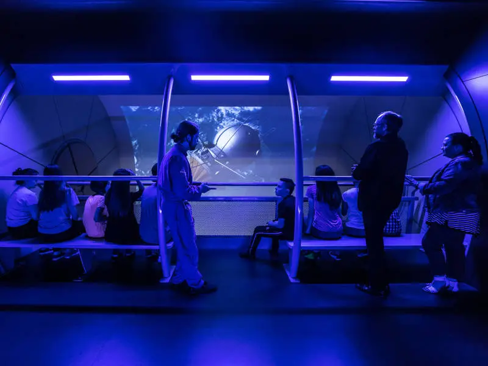</img>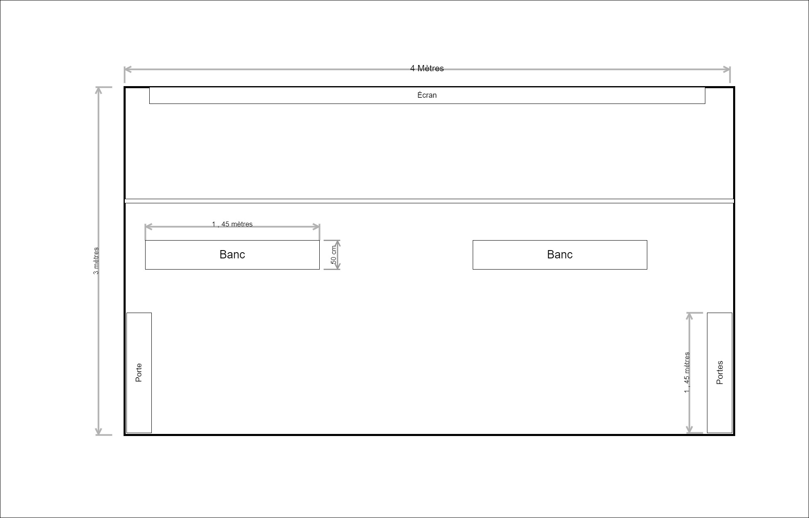</img>
>source de l'image : [Quoi faire en famille ](https://quoifaireenfamille.com/fiche/musee-site-historique/cosmodome/)

### Composante et technique 
Le fichier  vidéo

### Élement nécessaire à la mise en exposition
La première salle est composée d'un plancher sur élever par rapport mur qui sert de support a la projection. Il y a aussi 2 bancs pour s'asseoir. 
Avoir un haut plafond pour être en mesure d'y installer un plancher sur élevé où  les visiteurs vont pouvoir s'installer pour voir le dispositif.

### Expérience vécue
Le visiteur est invité à prendre place sur l'un des bancs pour être confortable toute le long de la vidéo. La vidéo porte sur le début de l'exploration de l'espace. Les premières missions et ce qu'elles ont eu pour but d'accomplir et une introduction à notre mission qu'on doit faire.

## Salle 2

### mise en espace
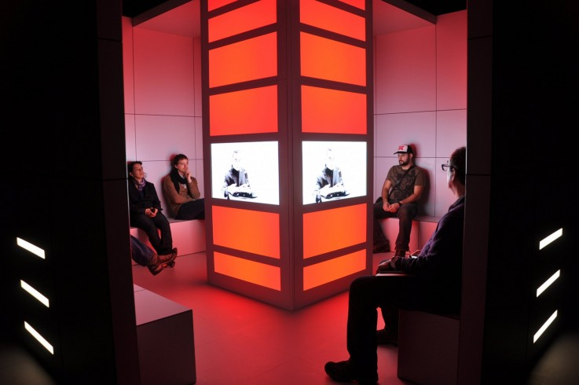</img>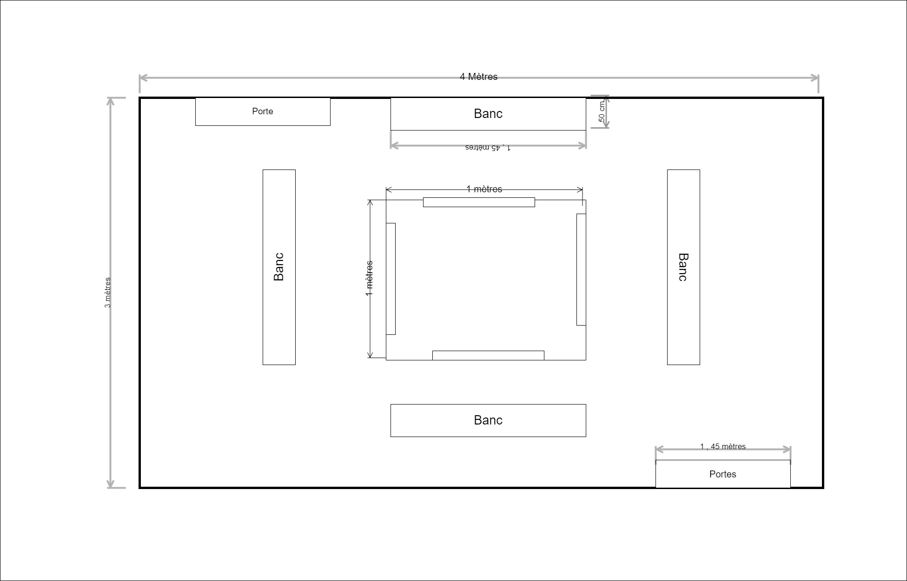</img>
>  image du dispositif source :[article]()
>  
### Composante et technique 
Le fichier  vidéo
 
### Élement nécessaire à la mise en exposition
Le dispositif est placé au centre de la pièce et entouré de bancs, sur la colonne du milieu on retrouve des écrans qui servent de support visuel.
La construction de la colonie centrale , les bancs , les murs qui servent surement de cache-fil.

### Expérience vécue
Le visiteur est attendu de s'asseoir sur un des bancs et d'écouter le vidéo explicatif. Le contenu de la vidéo nous sert de guide pour les prochaines étapes en nous présentant les planètes de notre système solaire et autres astres en nous donnant quelques informations sur ceux-ci. J'ai trouvé sa très intéressant qu'il nous dise diverses informations sur les planètes, car même si on les connait pas mal toute déjà ce rafraichir le cerveau fait toujours du bien surtout si ça peut nous aidé pour la suite de la mission.

## Salle 3

### mise en espace
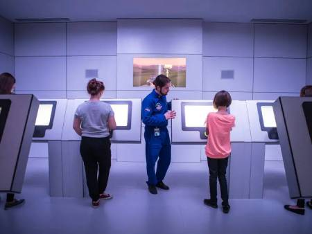</img>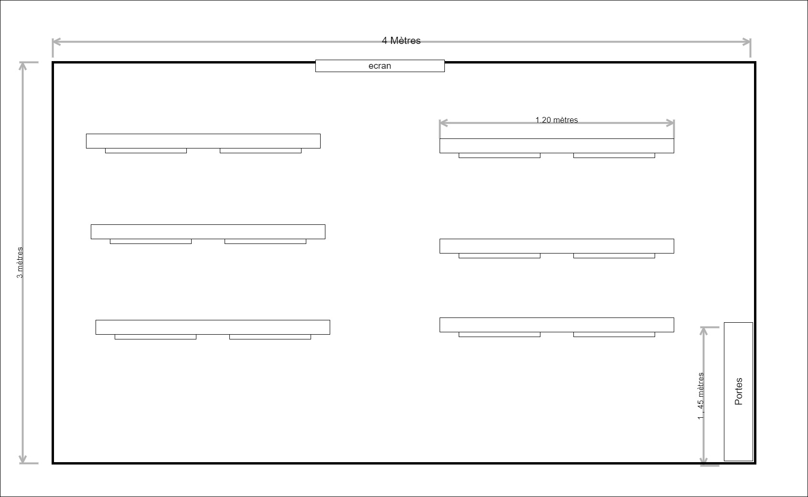</img>
>  image du dispositif source : [Quoi faire en famille ](https://quoifaireenfamille.com/fiche/musee-site-historique/cosmodome/)

### Composante et technique 
Les fichiers vidéos et le programme qui permet l'intéractivité des oeuvres. 

### Élement nécessaire à la mise en exposition
La construction des supports des écrans tactiles et  pour aussi cacher les fils et aussi avoir les écrans.

### Expérience vécue
Le visiteur est attendu de s'installer à un poste et attendre que le décompte se dévisse avant de recevoir les informations sur la prochaine étape de la mission. Ensuite, une fois la mission expliquer , les visiteurs sont invités a choisir une destination à explorer entre toutes les planètes du système solaire, les lunes de Jupiter et les astéroïdes, et de construire leur sonde pour si à envoyer .En fonction de l'astre choisie le visiteur doit ajouter certaine propriété comme la longueur de la sonde et que doit-elle contenir. Cette partie de la mission à été une de mes préférées, car même si tu ne fais pas le choix de module à utiliser , il te laisse recommencer en expliquant pourquoi ce n’est pas le bon module.

## Salle 4
### mise en espace
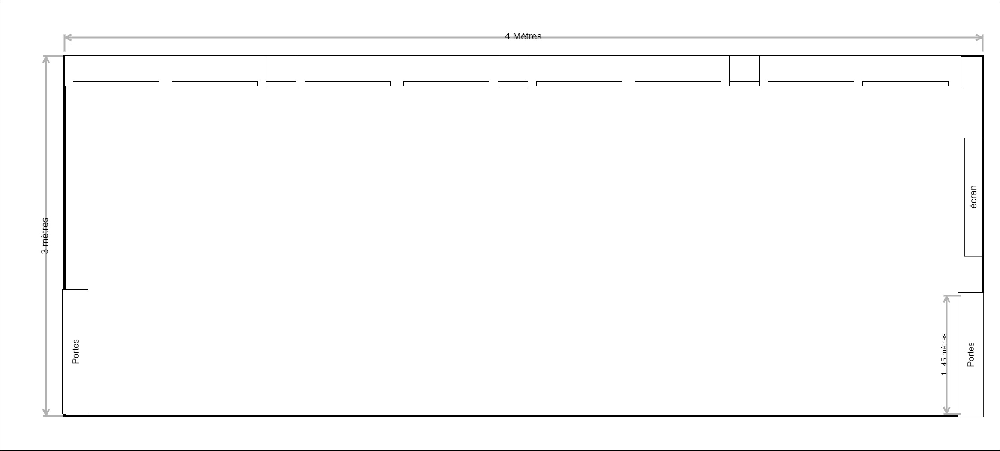</img>

### Composante et technique 
Les fichiers vidéos et le programme qui permet l'intéractivité des oeuvres. 
### Élement nécessaire à la mise en exposition
La construction des supports des écrans tactiles et  pour aussi cacher les fils.
### Expérience vécue
Dans cette salle le visiteur est attendu de choisir un poste et d'attendre les instructions donner dans la vidéo. Ensuite il a pour défis de faire atterrir sa sonde sur la plante ce qui peut paraitre facile, mais c'est plus dur qu'on pense, car on a l'emplacement de la plante quand il faut lancer la sonde, mais comme dans la vraie vie les planètes tournent autour du soleil donc il faut donc essayer de coordonner l'emplacement de la planète avec la vitesse de la sonde. Ce jeu était amusant, mais vraiment vraiment compliquer.

## Salle 5
### mise en espace
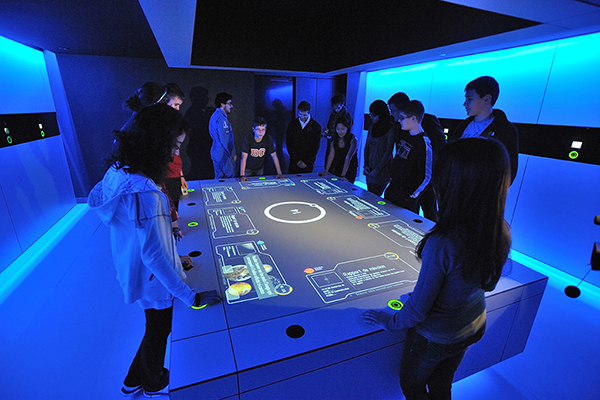</img> 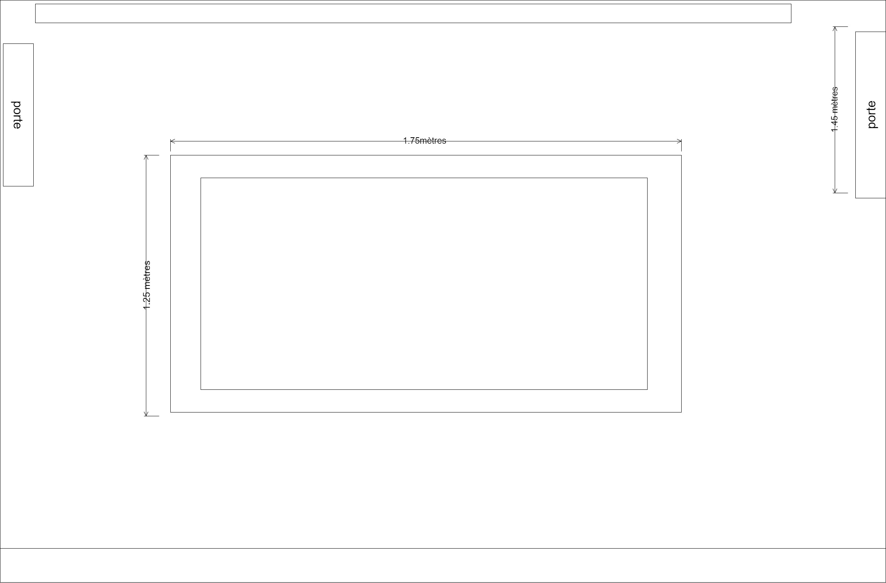</img>
>  image du dispositif source :[article]()
>  
### Composante et technique 
Les fichiers vidéos et le programme qui permet l'intéractivité des oeuvres. 

### Élement nécessaire à la mise en exposition
La construction du support pour pouvoir déposer l'écran et les murs sur le côté ou un retrouve les petite écran ou l'on put voir les images et le projecteur pour faire apparaitre les truc sur l'écran.

### Expérience vécue
Dans cette salle le visiteur est attendu de choisir un poste et d'attendre les instructions donner dans la vidéo. Ensuite il a pour défis de faire attérire sa sonde sur la planet ce qui peut paraitre facile mais c'est plus dure qu'on pense car on a l'emplacement de la planet quand il faut lancer la sonde mais comme dans la vrai vie les planètes tournent autour du soleil donc il faut donc essayer de coordoner l'emplacement de la planète avec la vitesse de la sonde. Ce jeu était amusant mais vraiment vraiment compliquer.

## Salle 6
### mise en espace
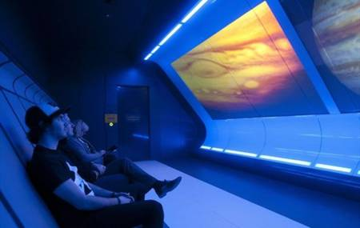</img> 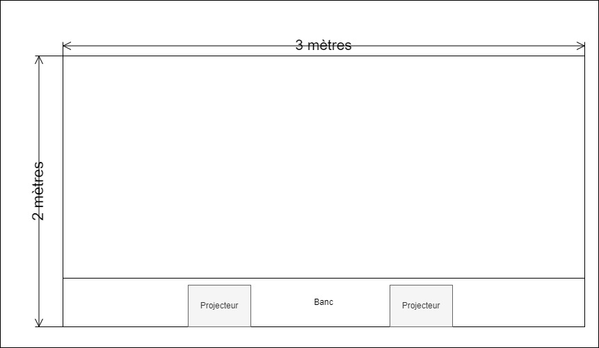</img>
>  image du dispositif source :[The Record ](https://www.therecord.com/life/travel/2012/01/06/travel-cosmodome-offers-a-virtual-trip-into-space.html?rf)
### Composante et technique 
Les fichiers vidéos 

### Élement nécessaire à la mise en exposition
La fabrication du banc et les 2 projecteur 

### Expérience vécue
Dans cette sa le visiteur est attendu de prendre place sur le banc, prêt à écouter la vidéo qui va suivre.Dans la vidéo on fait un retour sur la mission et on nous présente les découvertes qui on été faite et les choses de la vie de tout les jours qui ont été découvert grace a la conquête de l'espace.

# Ce qui m'a plu 
Expérience en tant que telle m'a beaucoup plus. Moi qui est passionée par l'espace à trouver ça vraiment intéressent. Les instructions claires et pa nébuleuses. Aussi la notion d'apprentisage que sa offre est plutot agréable. Aussi le choix que le dispositif offre et le reste de ton parcours sois différent selon l'astre choisie au départ donc il y a beaucoup de variation. Aussi on a l'impression de vraiment participé à la recherche aussi le fait qu'on peut personnalisé notre sonde. Moi et mon amie on a choisie Neptune donc dans notre son on devait mettre le disque d'or et on pouvais choisir se qu'on voulais mettre dessus. Aussi un petit plus c'est que même les enfant qui savent pas lire peuvent participer avec peut d'aide d'un parent car les consigne sont présenter sous forme de vidéo et aussi c'est très instinctif. Et aussi les décors rende l'expérience très réaliste.
# Aspect que je ne retiendrais pas 
L'utilisation des bracelets est super intéressente mais c'était quand même dure de les utiliser car il fallait appuyer vraiment fort dessus et même la sa marchait pas toujours donc on avait toujours l'impression que notre bracelet fonctionnais plus.
# Lien avec les autres oeuvres de la session
Lien avec l'oeuvre Écomarine des 3ème année. Le dispositif qu'elles ont créer servait aussi à en apprendre sur les mammifères marin représenter donc l'oeuvre à un but d'éduquer comme avec les missions du Cosmodome.
# Référence

