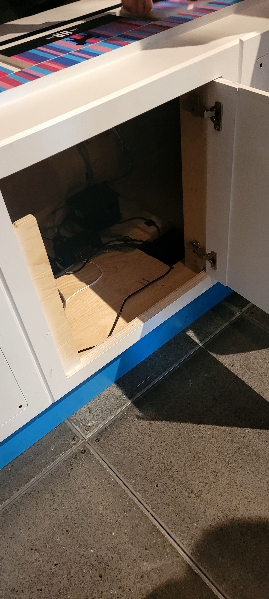

# Dispositif sur les gènes
## Lieu d'exposition
Centre des sciences de montreal
## Type d'éexposition
l'exposition Humain est une exposition permanante
## Date de la visite
## Titre de l'oeuvre 
## Nom de l'artiste ou de la firme
Le centre des sciences
## Année de création 
## Description de l'oeuvre ou du dispositif

## Type d'installation
Intéractive 
## Fonction du dispositif
</img>
## Mise en espace
le dispositif est entourer de d'autre oeuvre mais à environ 1 mètre et quelque de d'autre oeuvre.

## Composantes et techniques
- La structure du dispositif
- Les plaquette de bois 
- Le programme qui sert à faire apparaitre les infos sur l'écran
## Éléments 
</img>
- Les fils 

## Epérience vécu
le visiteur est attendu d'aligner la séquense d'ADN des plaquettes à la séquence d'ADN de la structure, pour révéler par la suite des informations et l,utilité du gène indiquer sur la plaquette

