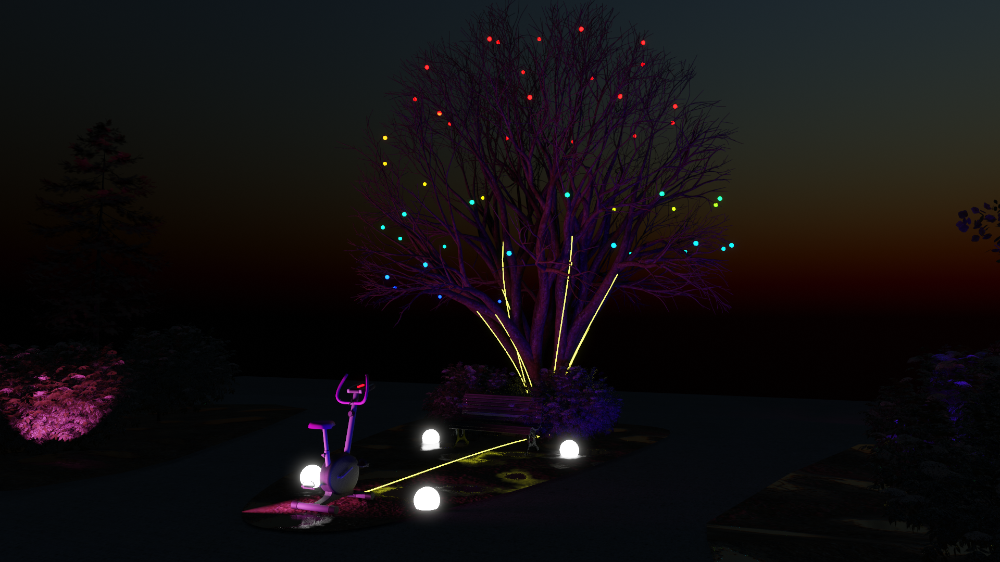
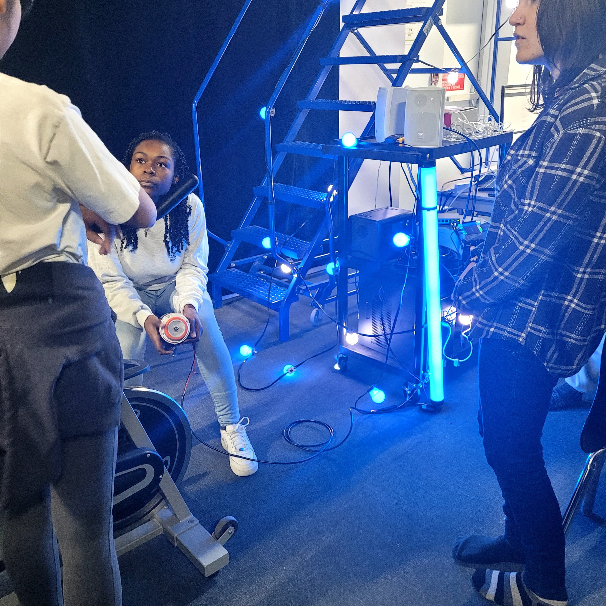

## Luma Sol 

##Présenter par 
Éloïse Gagné, Skayla Stimphil, Michaël Simard, Pénélope Morrisson 

## Lien avec Mycélium 
Le lien avec Mycélium est la cohabitation entre les nouvelle technologie et la nature pour créer un univers irréel et plutôt imaginaire.

## Schémas de plantation

##Photos du projet en cours

