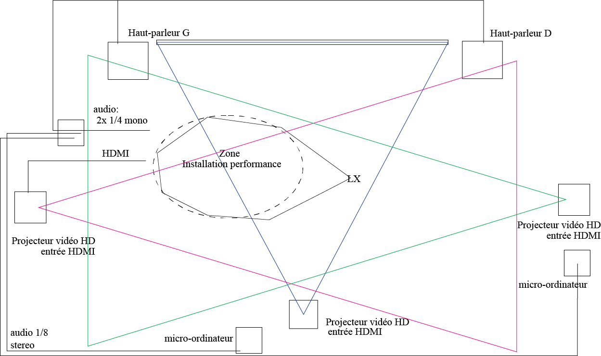

## Zodie-Gal 

#### Présenter par 
Abdanor Yara
#### Lien avec Mycélium 
Mycélium est comme un concepte de cohabitation avec la nature et Zodie -Gal est un jeu ou une jeune fille apprend a cohabité avec les changement de son corps à la puberté.

#### Schémas de plantation

