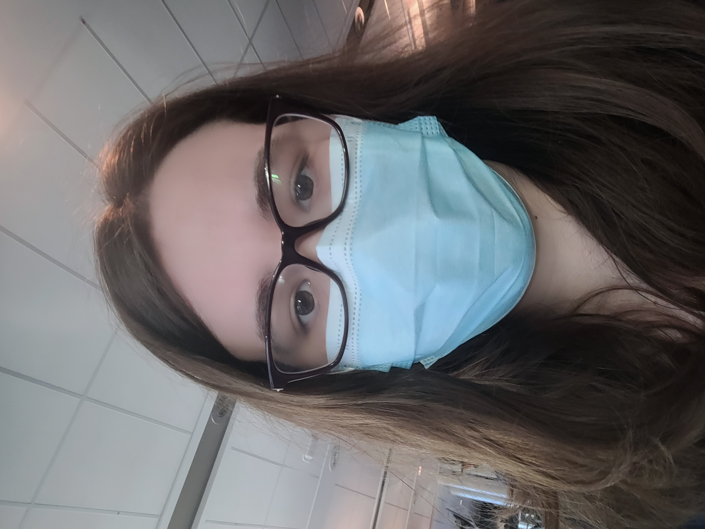

# Desjardins Jolyanne 
## photo

## Intéret dans le multimédia 
Ce que j'aime du multimédia c'est qu'on utilise plusieurs types de média pour créer des projets ou des oeuvres.Aussi ce que j'aime dans le multimédia c'est aussi l'aspect du travail d'équipe et de collaboration pour faire des projets. Aussi j'ai un intéret pour l'aspect technique et créatif.

## Autres intérets ou aspects
Un de mes cours préférés du programme c'est le cours de modélisation 3D et celui de communication graphique et l'aspect design de celui-ci. J'aprécis aussi écouté des films ou des séries et aussi j'adore lire.

